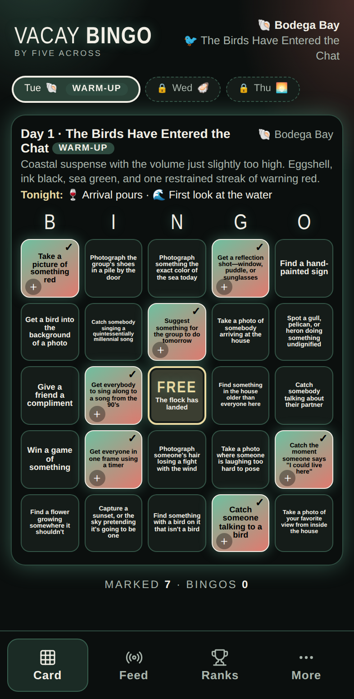
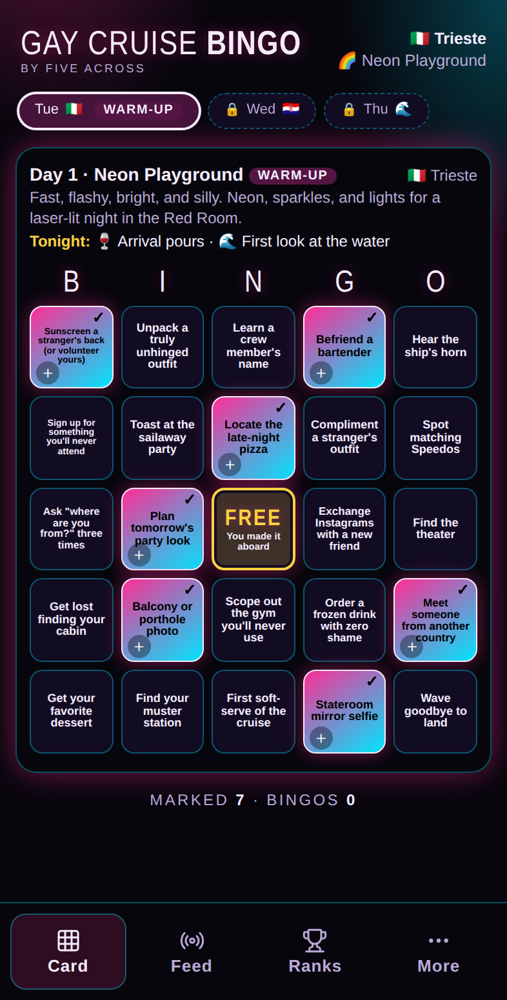
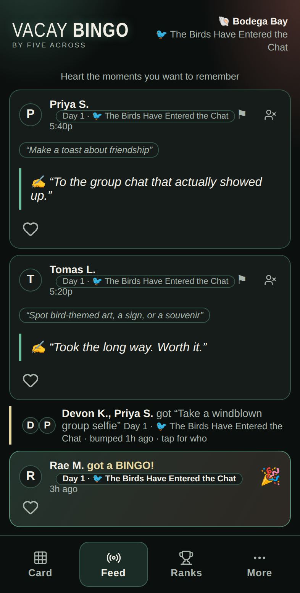
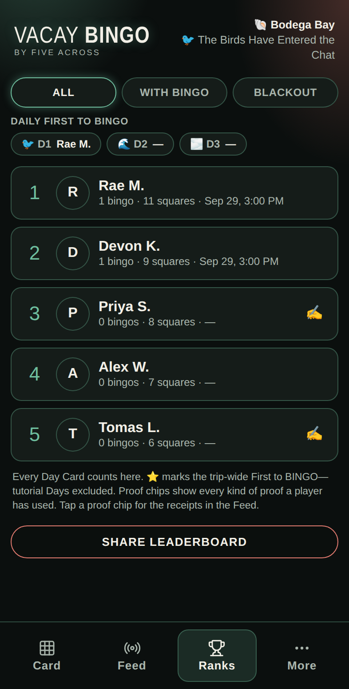
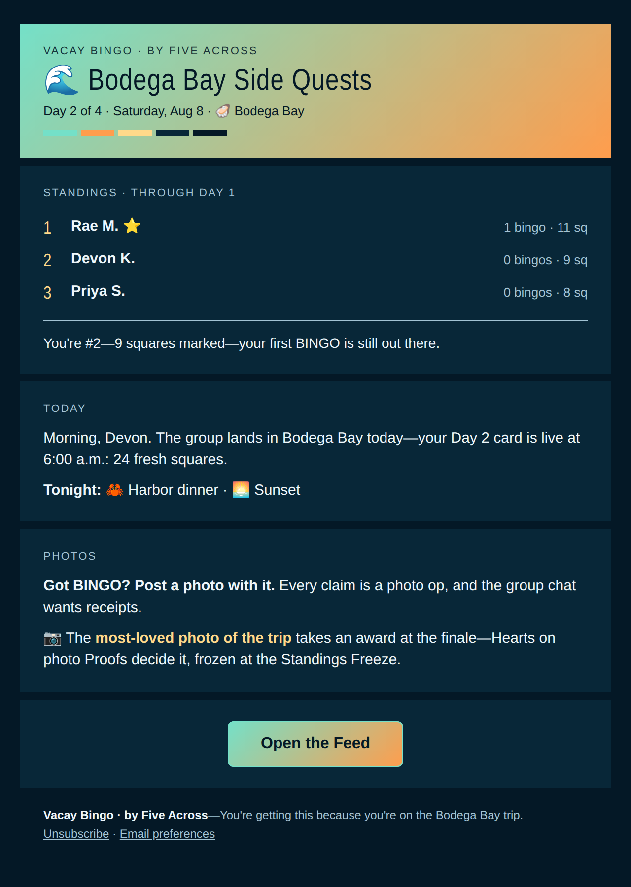
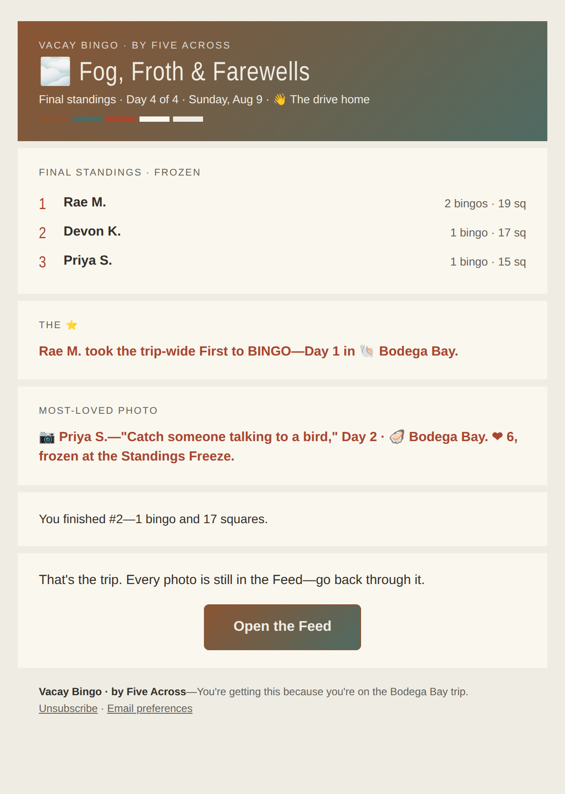

# Five Across

A live, phone-first social bingo platform (PWA) for a group sharing one occasion—a trip, a wedding, a conference, a festival. Sign in, get a randomized card of things that might happen there, and mark them off as they do, with a shared Feed, a leaderboard, per-Day Themes, PWA install, and Honor-mode Marks that queue durably offline and sync on reconnect. Proof media needs signal, and the stricter Claim Modes need connectivity to complete a Mark at all (ADR [0006](docs/adr/0006-offline-resilience.md)). Printed cards are the Gay Cruise Bingo Edition's own fallback for total failure, not a platform feature—each Edition states its own offline story.

The platform wears an **Edition** per class of occasion and runs one **Event** per occasion, addressed by its own hostname. See [`BRAND.md`](BRAND.md) for the Brand / Edition / Namespace model and [`CONTEXT.md`](CONTEXT.md) for the domain language.

**Read more:** the [Five Across project page](https://nathanpayne.com/projects/five-across/) is the case study—the problem, the eight-day launch, and the decisions made against each default, with what each one cost. [*The Product Did Not Travel*](https://nathanpayne.com/blog/the-product-did-not-travel/) follows the second Event, run for a different host, where nobody was still marking squares by Saturday afternoon—and the dinner ritual the cruise's engagement totals had been hiding. The [wireframes](https://raw.githack.com/nathanjohnpayne/fiveacross/main/plans/daily-cards-wireframes.html) ([source](plans/daily-cards-wireframes.html)) draw the player, admin, share and email surfaces across the platform and both Editions, painted with the shipped Theme tokens; they are the parity reference for the player-facing screens ([`specs/d15-mockup-parity.md`](specs/d15-mockup-parity.md)).

## Screenshots

The real app and the real email templates, captured over a seeded demo Event with invented players ([how they are made](docs/app/marketing-screenshots.md)). One platform, two Editions: the Vacay Bingo warm-up card beside the Gay Cruise Bingo one, then Vacay's Feed and Ranks.

<p>
  
  
  
  
</p>

The two player emails, both opt-in per Event: the morning Day Card, themed to the Day it announces, and the winner announcement after the Standings Freeze.

<p>
  
  
</p>

## Where it runs

| Edition | Event | Host | State |
|---|---|---|---|
| Gay Cruise Bingo | `med-2026`—Atlantis, Trieste → Barcelona | `gaycruisebingo.com` · `gaycruisebingo.web.app` | Sailed and completed, July 15–24 2026 |
| Vacay Bingo | `bodega-bay-2026`—Bodega Bay house trip | `bodega-bay.fiveacross.app` (canonical, [#599](https://github.com/nathanjohnpayne/fiveacross/issues/599)) · `bodega-bay.vacaybingo.com` and the apex `fiveacross.app` stay live as serving hosts. The #960 release checkpoint requires both aliases to name the new canonical host before a hostname-resolved deploy activates that analytics dimension. | Ran August 7–9 2026 |

Two production Firebase projects back these—`gaycruisebingo` and `fiveacross`—giving the Editions separate Firebase resources, credentials and deploy targets. One repository, one source tree, one release process; this is not a fork.

**It is also not cohort isolation yet.** ADR [0008](docs/adr/0008-five-across-second-firebase-project.md) is explicit that a separate project is not cohort admission: a person who can reach either public app can normally sign in to either Firebase project, and the current rules give path scoping rather than tenant isolation. Isolation stays deferred until authentication admission or membership-scoped rules are enforced—do not rely on the project split to keep one Event's audience out of the other's. Setup & runbook: [`docs/app/README.md`](docs/app/README.md).

## The game

- An **Event** owns an ordered list of **Days**; each Day owns a date, place, Theme, prompt Pool and unlock time. A Day stays locked until its unlock moment, then freezes a **Day Snapshot** of approved Prompts so everyone deals from the same pool no matter when they open the app.
- A **Day Card** is a frozen, randomized 5×5 board—24 sampled Prompts plus the always-marked Free Space. Five in a line is a **BINGO**; all 24 non-free is a **Blackout**.
- Marking is an **honor system**: the group, not the server, is the verification (ADR [0001](docs/adr/0001-honor-system-trust-model.md)). **Claim Modes** (Honor, Proof-to-mark, Admin-confirmed) are an Event-wide friction knob, not a trust hierarchy.
- An **Echo Mark** carries a confirmed Mark to every other card of yours holding the same Prompt. A **Reshuffle** trades a still-pristine card for a fresh deal, three per Event.
- **Tally** publishes a public, attributed per-Prompt record—a count plus tap-to-see-who-else-got-it—while your board's layout stays private. **Doubts** let one Player publicly ask another to back up a Mark; **Hearts** add warmth and touch no stats.
- The **Feed** carries Proofs (photo / audio / text), Moments that broadcast the big beats, and admin-authored Notices. The **Leaderboard** ranks bingos → squares → earliest first-bingo with a pinned First to BINGO, and a **Standings Freeze** computes the finale.
- **Share Cards** for a BINGO, the leaderboard and the final standings render on-device and go straight to the native share sheet (ADR [0005](docs/adr/0005-client-side-share-images.md))—no server in the path.
- **Community Prompts** let Players suggest a Prompt mid-Event for a later Day's card, attributed to the submitter. Approval is Admin-only and server-authoritative: the `approvePrompts` callable verifies the roster, routes each Prompt to its Day and stamps it in one transaction (ADR [0015](docs/adr/0015-server-authoritative-prompt-approval.md)).
- A **Block** is a per-Event, reciprocal, self-serviceable hide of another Player across the Feed, Proofs, Hearts, Doubts, Tally markers, the leaderboard and the podium. It is display-only on shared reads—scores, ranks and records stay real—it never stops a Doubt being raised, and it never narrows Admin moderation (ADR [0016](docs/adr/0016-player-blocking.md)).
- Google sign-in with a content-derived 18+ acknowledgement (ADR [0012](docs/adr/0012-server-derived-adult-content-posture.md)), Edition-scoped Themes, Honor-mode Marks that survive a dead zone and a reload (ADR [0006](docs/adr/0006-offline-resilience.md)), and analytics dual-dispatched to GA4 and PostHog, dimensioned by Brand / Edition / Event.

## Stack

Vite · React 19 · TypeScript (strict) · Firebase (Auth · Firestore · Storage · Hosting · Analytics) · `vite-plugin-pwa` with a custom service worker · Cloud Functions · Cloud Scheduler · Resend (email) · GA4 and PostHog · Cloudflare DNS, edge redirects and a Workers Event router (`worker/`, ADR [0014](docs/adr/0014-app-check-compatible-edge-routing-registry.md)).

The Functions package carries only what needs a server: scheduled Day unlocks (plus an Admin unlock-now callable) and finale computation; server-authoritative Community Prompt approval (ADR 0015); the central-origin sign-in handoff callables (ADR [0010](docs/adr/0010-centralised-auth-origin-with-handoff.md)—deployed, but no client reaches them until the first named Five Across deploy ships the handoff-mode client); server-authoritative hiding once a report count crosses the Event threshold, and revocation of a deleted Proof's stored media; three idempotent triggers that derive/reconcile the public adult-content posture from Prompt, Event and hostname writes; a bounded legacy-marker identity normalizer; the batched admin-alert digest and its archive lifecycle (ADR [0013](docs/adr/0013-admin-alert-archive-lifecycle.md)); the opt-in daily-card and winner-announcement emails with their unsubscribe endpoint, each off per Event by default; and bug-report intake. Cloud Vision proof moderation ships behind a deploy-time gate (`ENABLE_VISION_MODERATION`) and stays off until deliberately enabled—and because the thumbnail write lives inside that same handler, the default off state means proof uploads get **neither** Vision scanning nor server-side thumbnails. Player stats stay client-authoritative by design (ADR 0001).

## Quick start

The full setup—env, seeding, deploy, and custom domains—lives in the **[app guide](docs/app/README.md)**. The short version:

**Node 22.22 or newer is required** (`react-router` 8 sets the floor; `.nvmrc` pins the line, so `nvm use` selects it). On an older Node, `npm install` warns via `EBADENGINE` and then lets every command below run anyway—the failures that follow are unsupported-engine failures, not bugs.

```bash
cp .env.example .env.local     # fill from `firebase apps:sdkconfig WEB` — see app guide §2
npm install
npm run dev                    # local dev at http://localhost:5173
npm test                       # game-logic unit tests
npm run typecheck              # tsc --noEmit, app + service worker
```

`app-ci` gates every merge: typecheck (app, service worker, `worker/` and `router-publisher/`, plus the router publisher's no-Admin-SDK dependency check), unit and component tests, the production-origin integration seam (`test:origin`), build, the deployment safety harness (`test:deploy`), the shared JDK probe's own suite (`test:ensure-java`), the functions suite (`test:functions`—scheduler unlocks, finale computation and client/functions parity, easy-mix snapshots, bug-report validation, the Vision gate, server-authoritative auto-hide, adult-posture derivation/reconciliation, and legacy-marker normalization), and the emulator-backed rules and offline-durability suites (`test:rules`, `test:offline`). Playwright e2e (`test:e2e`) is a local smoke layer and is deliberately not run in CI. See [`docs/agents/testing-requirements.md`](docs/agents/testing-requirements.md).

Deploys go through `scripts/deploy.sh`, which wraps `op-firebase-deploy` (the 1Password-backed project deploy credential; never `firebase login` / `firebase deploy` directly) and enforces the main-branch, freshness and clean-tree guards.

**A multi-Edition deploy has three independent knobs.** The target commands below set all three together; do not invoke `scripts/deploy.sh` directly for Five Across.

1. **The build env.** `build:gaycruisebingo` and `build:fiveacross` load `.env.gaycruisebingo` and `.env.fiveacross` respectively, overriding a developer's ambient `.env.local` so the selected project is what gets baked.
2. **The Firebase target.** Each deploy command passes its project ID explicitly; `.firebaserc`'s Gay Cruise Bingo default is never used for a Five Across deploy.
3. **The cache zone.** Gay Cruise Bingo uses its default Cloudflare zone. Five Across is DNS-only, so its deploy command skips a purge rather than touching the Gay Cruise Bingo zone.

Within the build environment, `VITE_ADULT_CONTENT` is a single-Event posture seed, not a permanent switch: only the literal value `false` hides the initial gate, and the deployed origin must also have a `hostnames/{host}` document because the live watcher re-proves that opt-out and observes a later server-side raise. Hostname-resolved builds ignore this seed and use the routing document directly (ADR 0012; app guide § Event id).

```bash
# Full project deploys
npm run deploy:gaycruisebingo
npm run deploy:fiveacross

# Hosting-only deploys
npm run deploy:gaycruisebingo:hosting
npm run deploy:fiveacross:hosting
```

The target files are local and ignored because they contain the client configuration for each Firebase web app. They are not secrets, but keeping them out of the repository prevents an outdated deployed configuration from becoming source of truth. See [`docs/app/deploy-targets.md`](docs/app/deploy-targets.md) for setup and verification.

## Documentation

| Doc | What |
|---|---|
| [`CONTEXT.md`](CONTEXT.md) | Domain model and ubiquitous language—the canonical vocabulary |
| [`BRAND.md`](BRAND.md) | Brand, Editions, Namespaces, Themes, and the 18+ posture |
| [`docs/app/README.md`](docs/app/README.md) | App guide + deploy / seed / custom-domain runbook |
| [`docs/app/phase-1-deploy.md`](docs/app/phase-1-deploy.md) | Backend deploy (Functions, App Check) |
| [`docs/app/preview-deploys.md`](docs/app/preview-deploys.md) | Previewing a branch on a real device, with working Google sign-in |
| [`docs/adr/`](docs/adr/) · [`docs/architecture/`](docs/architecture/) | Architecture decision records |
| [`specs/`](specs/) | Per-feature contracts—this repo's canonical spec source |
| [`plans/daily-cards-wireframes.html`](plans/daily-cards-wireframes.html) ([rendered](https://raw.githack.com/nathanjohnpayne/fiveacross/main/plans/daily-cards-wireframes.html)) | Tri-brand wireframes of the player, admin, share and email surfaces; prose source of truth is [`plans/daily-cards-spec.md`](plans/daily-cards-spec.md) |
| [`docs/projects/gaycruisebingo/prds/gaycruisebingo.md`](docs/projects/gaycruisebingo/prds/gaycruisebingo.md) | Founding PRD. Describes the first Edition only and predates the platform model—`CONTEXT.md` and the ADRs win where they differ |
| [`DEPLOYMENT.md`](DEPLOYMENT.md) | Deploy tooling + 1Password credential model |
| [`CONTRIBUTING.md`](CONTRIBUTING.md) · [`SECURITY.md`](SECURITY.md) | Contribution workflow · security policy |

## Layout

| Path | Purpose |
|---|---|
| `src/` | App code: game logic, Firebase init, Event/Edition resolution, auth, theme, hooks, components |
| `functions/` | Cloud Functions (unlocks, finale, moderation, marker normalization, email, bug reports—stats stay client-authoritative, ADR 0001) |
| `router-publisher/` | Isolated keyless Function codebase that signs private Event-router registry updates without an Admin SDK dependency |
| `worker/` | Public Event-router code plus the separately configured, unrouted private registry Worker and lookup harness |
| `public/` | Static assets served verbatim (icons, manifest, `og-default.png`, service worker) |
| `firestore.rules` · `storage.rules` · `firestore.indexes.json` | Security rules + indexes |
| `scripts/` | Seed script + build / CI / deploy tooling |
| `tests/`, `src/**/*.test.*` | Automated validation |
| `docs/`, `specs/`, `plans/`, `rules/` | Docs, product specs, execution plans, and binding repo constraints |

## Contributing

Changes land via branch + pull request—see [`CONTRIBUTING.md`](CONTRIBUTING.md).

## License

Licensed under the [Apache License 2.0](LICENSE). The license covers the code and content in this repository; it grants no rights to the Five Across, Gay Cruise Bingo or Vacay Bingo names and marks (§6).
