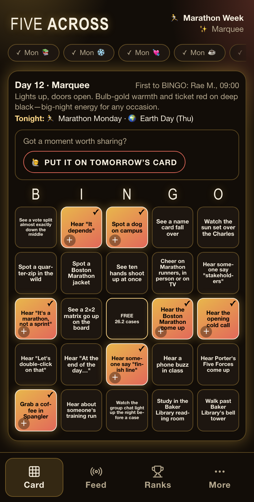
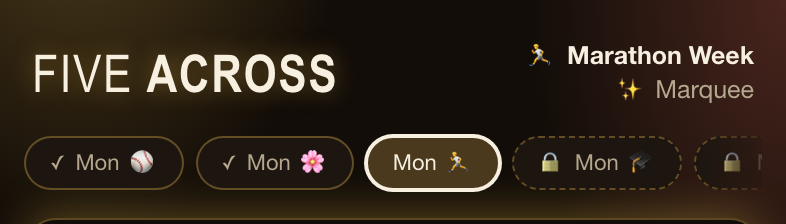
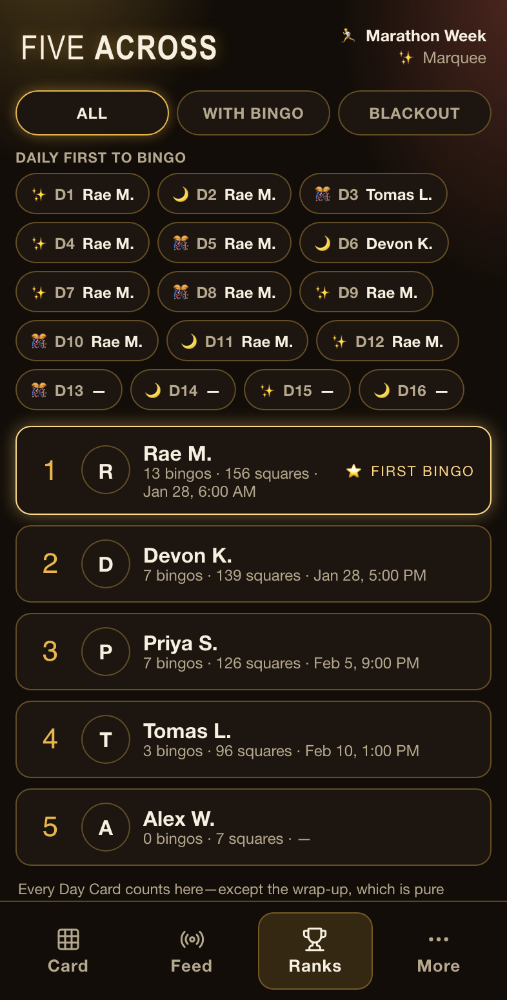
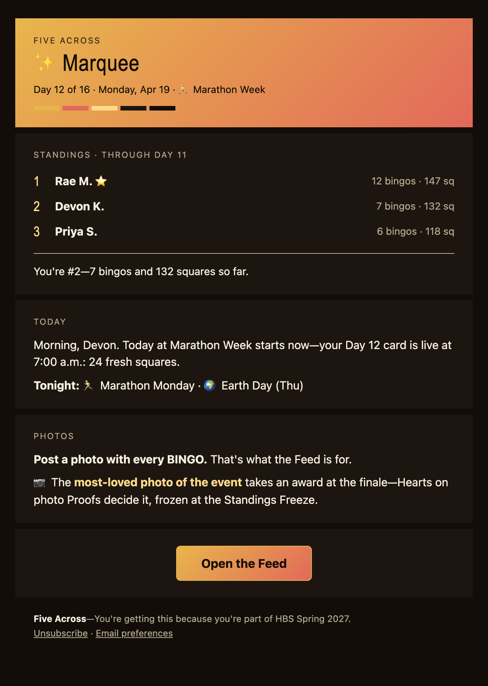

---
tags:
  - fiveacross
  - hbs-spring-2027
  - weekly-cadence
  - prompt-pools
  - draft
---
# HBS Spring 2027—a semester of weekly cards

Draft for editing. The first Event on the Five Across Edition and the first on a **weekly cadence**: each Day Card is a one-week game, sixteen of them across the Harvard Business School spring term (January 25–May 19, 2027). Every entry is `spicy: false`—a general-audience Event with `settings.spicyRatio: 0`. The squares are deliberately easy: a mix of things you do on campus and things you hear in a case discussion.

Working Event id: `hbs-spring-2027`. The public Slug is still open—see "URL" below.

## The shape of the game

- **One card per week.** Each card unlocks Monday at 7:00 a.m. Eastern and stays the current card until the next one unlocks. Past cards stay markable, as they already do.
- **Spring break is a gap, not a card.** Week 7's card unlocks March 8 and stays current through the break (March 13–21); Week 8 unlocks March 22. The scheduler already handles uneven gaps: every Day unlocks on its own `unlockAt`.
- **One leaderboard for the term.** Weeks 1–15 are competitive. Week 16 is the ceremonial Victory Lap, dealt from the closing pool. Its unlock (Monday, May 17, 7:00 a.m.) is the Standings Freeze, so the podium lands while RC students are still on campus, two days before their term ends. This mirrors Bodega Bay's wrap-up Day.
- **One email a week, not one a day.** The engagement email goes out Monday morning after the card unlocks: last week's standings, the new card, and the week's theme. Week 16's email is the podium email.
- **The EC/RC split.** EC finals end around April 28 (Week 13 is their send-off card); RC runs to around May 19. Weeks 14–16 lean RC but every square still works for a second-year who's still around.

### Composition of a card

24 squares plus the free centre, as everywhere else. With `easyMixRatio: 0.5`:

- **12 from the easy pool** (40 near-certain squares, every week).
- **12 from the main half**, of which about **6 are reserved for this week's themed squares** (8 per week) and the rest come from the evergreen main pool (80 squares: 40 heard-in-class, 40 on-campus).

Reserving the themed squares is what makes Week 12 feel like Marathon Week rather than a random draw that happens to include one marathon square. Six of eight also means most players share most of the week's themed squares, which is what makes the Tally fun ("who else spotted a marathon jacket?").

**Counts: 40 easy / 80 evergreen main / 120 weekly (8 × 15) / 32 closing = 272.**

Every Day sets its own `freeText` (there's no Event-level free space, and the fallback is Gay Cruise Bingo copy). Each Day's `place` holds the week's title, so the card header reads "Week 12 · Apr 19 · Marathon Week."

## Mockups

Four mockups of the proposed Event, made with the repo's marketing screenshot tool: the real app and the real email template, running over an emulator-seeded demo Event that carries this plan's content (week titles, Themes, free spaces, "this week" lines, and Week 12's squares) and invented players. **They are not finished weekly UI.** The weekly vocabulary doesn't exist yet (ticket T1), so every screen still says "Day 12", "today", and "Tonight", and the captions call out each place that will change. How to regenerate them is in [`docs/app/marketing-screenshots.md`](../docs/app/marketing-screenshots.md#the-hbs-weekly-mockups).

*The Board, Week 12 (Marathon Week), Wednesday evening, seven squares marked. Current daily wording: the header reads "Day 12", the invite reads "Put it on tomorrow's card", and the line reads "Tonight:" (all T1). The card is the planned split of 12 easy, 6 themed, and 6 evergreen squares, hand-picked from the pools below and dealt by the real dealer, because the themed reserve (T3) doesn't exist yet; today's dealer wouldn't guarantee six Marathon squares.*

*The week header and Day switcher, scrolled by hand to the current week (the row opens at Week 1). Every chip reads "Mon" because chips show the weekday, which is what T1 changes to "Wk N". Left to right: Weeks 10 and 11 (done), Week 12 (selected), Week 13 (locked).*

*The leaderboard in Week 12, with invented players. Current daily wording: "Daily first to bingo", chips "D1" to "D16". The chips from D11 on are blank because today's client only supports Day indexes 0–9, one of the places T2 has to move (the honours read). The signed-in demo player is the one at 0 bingos.*

*The Monday engagement email, rendered from the real template for Week 12. Current daily wording: "Today at Marathon Week starts now—your Day 12 card is live", "Standings · through Day 11", and "Tonight:". The weekly register is T4.*

## URL

Every Event is reachable at `<slug>.fiveacross.app`, and an Event can carry more than one hostname (an Alias serves in place with the same branding), so we can choose a canonical address and add a second later.

| Slug | Why | Watch out for |
|---|---|---|
| **`skydeck`** (recommended) | Insider shorthand for the back rows of an HBS classroom. Short, memorable, and an HBS student gets it instantly. | Nothing much. Outsiders won't get it, which is part of the charm. |
| `coldcall` | The defining case-method moment; everyone gets it. | HBS already publishes a podcast called *Cold Call*. Fine as an Alias, less ideal as the main name. |
| `casemethod` | Says exactly what it is. | Earnest rather than fun. |
| `chipshot` | Insider joke (a comment made for participation credit). | Reads as golf to anyone else. |
| `soldiersfield` | The campus's actual address. | Long; easy to misspell. |
| `hbs` / `hbs27` | Clearest of all. | Uses the school's mark. Harvard actively polices "Harvard" and "HBS" in names, so only use it with the school's blessing (a club or the student association as Host would help). |

All of these are valid Slugs (3–63 characters, lowercase letters, digits, and hyphens) and none collides with a reserved word.

## Weekly calendar

Visual Themes rotate through the Five Across Edition's three: ✨ Marquee (doors open), 🎊 Confetti Hour (the peak), 🌙 Afterglow (the wind-down). "This week" is the Day's two-line `tonight` field, repurposed for the week's highlights.

| Wk | Unlocks | Title | Theme | Free space | This week |
|---|---|---|---|---|---|
| 1 | Mon Jan 25 | 📚 Syllabus Week | Marquee | New term, same section | 🪑 New seats · ☕ First coffee chats |
| 2 | Mon Feb 1 | ❄️ Snow Day Energy | Afterglow | Survived the walk to class | 🧤 Layers on · 🏮 Lunar New Year (Sat) |
| 3 | Mon Feb 8 | 💘 Hearts & Spreadsheets | Confetti Hour | In love with Exhibit 4 | 🍫 Candy everywhere · 💌 Valentine's Day (Sun) |
| 4 | Mon Feb 15 | ☕ Coffee Chat Season | Marquee | Networking counts as cardio | 🎩 Presidents' Day (Mon) · 💼 Recruiting mode |
| 5 | Mon Feb 22 | 🎤 Conference Circuit | Confetti Hour | Lanyard acquired | 🎤 Student conferences · 🥂 Receptions |
| 6 | Mon Mar 1 | 📈 Halfway There | Afterglow | Halfway through the term | 📈 Midpoint · 📚 Catch-up mode |
| 7 | Mon Mar 8 | ✈️ Out of Office | Marquee | OOO in 3, 2, 1… | ✈️ Treks take off · 🌴 Break starts Sat |
| — | Mar 13–21 | *Spring break—no new card* | | | |
| 8 | Mon Mar 22 | 🧳 Back from Break | Confetti Hour | Tan lines in Aldrich | 🧳 Welcome back · 🌇 Light past 7 p.m. |
| 9 | Mon Mar 29 | 🏀 Bracket Season | Marquee | My bracket is busted | 🃏 April Fools' (Thu) · 🏀 Final Four weekend |
| 10 | Mon Apr 5 | ⚾ Opening Day | Confetti Hour | Take me out to Fenway | ⚾ Baseball's back · 🌤️ Patio weather |
| 11 | Mon Apr 12 | 🌸 Spring on the Charles | Afterglow | First day without a coat | 🌸 Blossoms · 🚣 Crews on the river |
| 12 | Mon Apr 19 | 🏃 Marathon Week | Marquee | 26.2 cases | 🏃 Marathon Monday · 🌍 Earth Day (Thu) |
| 13 | Mon Apr 26 | 🎓 EC Last Call | Confetti Hour | Standing ovation | 👏 Last EC classes · 📝 EC exams wrap (Wed) |
| 14 | Mon May 3 | 🏁 Home Stretch | Afterglow | Running on cold brew | 🏁 Two weeks to go · 💐 Mother's Day (Sun) |
| 15 | Mon May 10 | 📝 Final Cases | Marquee | One more case | 📝 Last full week · 📸 Section photos |
| 16 | Mon May 17 | 🎉 Victory Lap (ceremonial; Standings Freeze) | Afterglow | Section forever | 🏆 Podium reveal · 🎓 Last RC classes |

Two squares span two weeks because their date is uncertain or straddles a boundary: *Celebrate Lunar New Year with classmates* (Weeks 2–3) and *Hear a Super Bowl ad come up in class* (Weeks 3–4).

---

## Easy pool (40)

The Easy Mix source on every card, so everything here is near-certain in any week of the term. *(Stored under the legacy `embark` pool value.)*

1. Hear the opening cold call
2. Hear "Building on what ___ said…"
3. Hear "Let me push back on that"
4. Hear "At the end of the day…"
5. Hear "To piggyback on that…"
6. Hear someone say "framework"
7. Hear someone say "stakeholders"
8. Hear someone say "low-hanging fruit"
9. Hear a comment that starts "At my old job…"
10. Hear "If I were the protagonist…"
11. Hear someone cite an exhibit by number
12. Hear "Let's put some numbers on the board"
13. Catch a sports analogy in a business discussion
14. See a 2×2 matrix go up on the board
15. See the professor fill an entire board
16. See the professor call for a vote
17. See a name card fall over
18. See someone slip in after class starts
19. See ten hands shoot up at once
20. Get your comment in before the halfway mark
21. Raise your hand and actually get called on
22. Grab a coffee in Spangler
23. Eat lunch in Spangler
24. Walk past Baker Library's bell tower
25. Spot someone in a fleece vest
26. Spot a quarter-zip in the wild
27. Read a case in under 30 minutes
28. Watch the group chat light up the night before a case
29. Score free food at a club event
30. Have a coffee chat
31. Get a meal with someone outside your section
32. Spot an Exec Ed group on campus
33. Hear the professor say "Great point"
34. Hear the professor ask "What would you do?"
35. Hear someone say "It depends"
36. Spot a tour group on campus
37. Hold the door for a section-mate
38. Hear "I'll play devil's advocate"
39. Hear a phone buzz in class
40. Learn something new about a section-mate

## Evergreen main pool (80)

Untargeted, so eligible on every competitive card. Two halves of 40.

### Heard in class (40)

1. Hear "Let's double-click on that"
2. Hear someone say "move the needle"
3. Hear someone say "circle back"
4. Hear someone mention a "north star"
5. Hear someone say "unit economics"
6. Hear someone say "moat"
7. Hear someone say "first principles"
8. Hear Porter's Five Forces come up
9. Hear "disruptive innovation" come up
10. Hear back-of-the-envelope math done out loud
11. Hear someone bring up NPV or IRR
12. Hear a comment open with "As a former consultant…"
13. Hear AI come up in a case that isn't about AI
14. Hear a case tied to this week's headlines
15. Hear someone reference a case from earlier in the term
16. Hear "I actually see it differently"
17. Watch two classmates go back and forth
18. Watch someone change their vote mid-class
19. See a vote split almost exactly down the middle
20. Hear a number from the case quoted to the decimal
21. Hear the professor reveal what actually happened
22. See a case protagonist visit class
23. Applaud a guest in class
24. Watch a video clip in class
25. Hear the professor tell a story about a former student
26. Hear the professor use a student's name in a hypothetical
27. Laugh at the professor's joke
28. See the professor climb up to the sky deck
29. Hear a cold call land on the sky deck
30. Hear a chip shot
31. See a board get erased to make room
32. Hear the professor ask "What's the decision?"
33. Hear someone mention Warren Buffett
34. Hear someone mention Steve Jobs
35. Hear "Culture eats strategy for breakfast"
36. Hear someone say "pivot"
37. Hear "It's a people problem"
38. Hear someone thank the previous speaker
39. Hear someone say "scalable"
40. See class run a minute over

### On campus (40)

1. Study in the Baker Library reading room
2. Walk across the Weeks Footbridge
3. Work out at Shad Hall
4. Attend a club speaker event
5. Catch a talk in Klarman Hall
6. Visit the Harvard i-lab
7. Go to office hours
8. Book a study room
9. Grab a meal with your study group
10. Go to a section event
11. Cheer at a Harvard game
12. Walk past Harvard Stadium
13. Spot a dog on campus
14. Run into a professor outside class
15. Snap a photo of the Baker Library tower
16. Watch the sun set over the Charles
17. Walk through Harvard Yard
18. Watch a tourist rub John Harvard's foot
19. Browse the Harvard Coop
20. Grab a bite in Harvard Square
21. Visit the Harvard Art Museums
22. Ride the Harvard shuttle
23. Go to a student social
24. Join a club lunch-and-learn
25. Pick up free swag
26. Spend three hours in Spangler without meaning to
27. Find a new study spot on campus
28. Introduce yourself to someone from the other class year
29. Grab coffee with a classmate you haven't talked to
30. Take a group photo with section-mates
31. Snap the campus from across the river
32. Walk to class with a section-mate
33. Help a classmate prep for a cold call
34. Prep a case with your study group
35. Go to a career or recruiting event
36. Borrow a book from Baker Library
37. Try a new dish in Spangler
38. Join a pickup game or a fitness class
39. Volunteer for a club or an event
40. Give a section-mate a shout-out

## Weekly themed squares (8 per week, 120)

Each is admitted only to its own week's card (see "Engineering" T3). Numbering restarts per week.

### Week 1—📚 Syllabus Week (Jan 25)

1. Sit in your seat for the new term
2. Set up your name card
3. Get asked "How was break?"
4. Hear a winter-break travel story
5. Hear a professor explain their participation policy
6. Meet a new professor
7. Hear someone mention a New Year's resolution
8. Open the first case of the term

### Week 2—❄️ Snow Day Energy (Feb 1)

1. Spot snow on the Baker lawn
2. See someone arrive in snow boots
3. See ice on the Charles
4. Hear the weather come up in class
5. Drink a hot chocolate on campus
6. Spot a snowman (or a sad snow pile) on campus
7. Hear about a cancelled flight
8. Celebrate Lunar New Year with classmates *(also Week 3)*

### Week 3—💘 Hearts & Spreadsheets (Feb 8)

1. Hear someone's Valentine's plans
2. Spot Valentine's candy on campus
3. Hear someone talk about customer loyalty
4. Send a section-mate a valentine
5. Spot a Valentine's outfit
6. Get a date-night restaurant rec
7. Hear the professor make a Valentine's joke
8. Hear a Super Bowl ad come up in class *(also Week 4)*

### Week 4—☕ Coffee Chat Season (Feb 15)

1. Spot someone in a suit before class
2. Hear "I have a coffee chat after this"
3. Watch someone practice a case interview
4. Hear someone say "I'm recruiting for…"
5. Run a mock interview with a classmate
6. Write a thank-you note after a chat
7. Hear a U.S. president come up in class
8. Hear someone mention a superday

### Week 5—🎤 Conference Circuit (Feb 22)

1. Attend a student-run conference
2. Wear a conference lanyard
3. Hear a keynote speaker
4. Grab conference swag
5. Volunteer at a conference
6. Hear a CEO speak on campus
7. Swap LinkedIns at a reception
8. See a classmate post about a conference

### Week 6—📈 Halfway There (Mar 1)

1. Hear someone say "We're halfway through"
2. Hear someone say "I'm so behind on cases"
3. Pull a late night in Baker Library
4. Meet up with your learning team or study group
5. Hear someone mention their participation grade
6. Reorganize your case notes
7. Treat yourself to dinner in Harvard Square
8. Hear a professor recap the term so far

### Week 7—✈️ Out of Office (Mar 8)

1. Hear about someone's trek
2. Hear a spring break destination you'd never considered
3. Spot a suitcase on campus
4. Hear someone mention their passport
5. Hear "I'll read it on the plane"
6. Hear the professor wish everyone a good break
7. Set an out-of-office reply
8. Swap break plans with a section-mate

### Week 8—🧳 Back from Break (Mar 22)

1. Spot a fresh tan or sunburn
2. Hear a trek story
3. See someone's break photos
4. Hear "I'm still jet-lagged"
5. Notice it's still light out after class
6. Hear "I didn't read the case on the plane"
7. Get a snack someone brought back from break
8. Hear the professor say "Welcome back"

### Week 9—🏀 Bracket Season (Mar 29)

1. Hear someone mention their bracket
2. Watch a game in Spangler
3. Hear someone say "Cinderella story"
4. Hear who's winning the section bracket
5. Spot a college team shirt
6. Hear someone bring up their alma mater
7. Witness an April Fools' prank
8. Hear "buzzer-beater" used about a deadline

### Week 10—⚾ Opening Day (Apr 5)

1. Spot a Red Sox cap
2. Hear Fenway come up
3. Hear a baseball analogy in class
4. Hear Moneyball come up
5. Hear someone talk sports analytics
6. Spot someone playing catch on campus
7. Watch an inning of a Sox game
8. Hear "step up to the plate"

### Week 11—🌸 Spring on the Charles (Apr 12)

1. Leave your coat at home
2. Eat lunch outside
3. Sit on the Baker lawn
4. Spot a tree in bloom on campus
5. Spot a rowing crew on the Charles
6. See someone wear shorts to class
7. Walk along the Charles
8. Hear someone blame allergies

### Week 12—🏃 Marathon Week (Apr 19)

1. Hear the Boston Marathon come up
2. Spot a Boston Marathon jacket
3. Cheer on Marathon runners, in person or on TV
4. Hear "It's a marathon, not a sprint"
5. Hear about someone's training run
6. Go for a run along the Charles
7. Hear sustainability come up in class
8. Hear someone say "finish line"

### Week 13—🎓 EC Last Call (Apr 26)

1. Give a professor a standing ovation
2. Hear a professor's last-class life lesson
3. Take a photo with a professor
4. Hear someone say "I'm going to miss this"
5. Hear someone mention a final exam
6. Congratulate a second-year on finishing classes
7. See someone get emotional in class
8. Hear a second-year share their post-HBS plans

### Week 14—🏁 Home Stretch (May 3)

1. Hear "Only two weeks left"
2. Hear someone's summer internship start date
3. Hear someone talk summer sublets
4. Hear someone's Mother's Day plans
5. Order your first iced coffee of the season
6. Study in Spangler with classmates
7. Hear the word "finals"
8. Plan a summer meetup with classmates

### Week 15—📝 Final Cases (May 10)

1. Hear "This is our last case on…"
2. Swap exam strategies with a classmate
3. Bring snacks to a study session
4. Hear a comment that sums up the whole course
5. Fill out a course evaluation
6. Hear someone say "What a year"
7. Snap a section photo
8. Thank a professor after class

## Closing pool—🎉 Victory Lap (32)

Week 16's whole card. Ceremonial: marks don't move the standings, which froze at this card's unlock. *(Stored under the legacy `farewell` pool value.)*

1. Make it to the last RC class
2. Join a final standing ovation
3. Get in the section photo
4. Hear a toast to the section
5. Swap numbers with someone you wish you'd met sooner
6. Hear a professor's last words of the year
7. Finish your last exam
8. Take your name card home
9. Hug a section-mate
10. Post a goodbye in the section chat
11. Eat one last lunch in Spangler
12. Grab one last Spangler coffee
13. Take a selfie in front of Baker Library
14. Plan a summer reunion
15. Hear where three classmates are interning
16. Shed a happy tear
17. Hear someone's Commencement plans
18. Hear "See you in September"
19. Write a thank-you note to a professor
20. Walk the Weeks Footbridge one more time
21. Take a photo on the Baker lawn
22. Celebrate at a section party
23. Catch one last sunset over the Charles
24. Hear "I can't believe it's over"
25. Write a note to a section-mate
26. Name your favorite case of the year
27. Share your best cold-call story
28. Hand out (or win) a section superlative
29. Hear someone say "Best year ever"
30. Return something you borrowed this term
31. Thank someone who helped you this term
32. Share your favorite photo from the semester

---

## Engineering

The platform already handles most of this: Days unlock on arbitrary dates with arbitrary gaps, the current card stays current until the next unlock, past cards stay markable, and the engagement email is sent once per Day's date, so weekly Days already produce weekly email. What's missing is below, in dependency order. T2 is decided and being implemented (#1357). T9 is decided too (#1360): Echo off and a 4-card repeat window for this Event. It must land before the seed (T5), because the seed sets `echoMarks: false`.

**T1—Weekly cadence on the Event.** Add `EventDoc.cadence?: 'daily' | 'weekly'` (absent means daily, so nothing live changes). It's a property of the Event, not the Edition: a Five Across wedding is still daily. Add one vocabulary helper, the cadence counterpart of the Lexicon (`day`/`week`, `today`/`this week`, `tomorrow's card`/`next week's card`, `tonight`/`this week`), and sweep the hard-coded copy through it:

- `TomorrowsCardInvite` ("Put it on next week's card"; its wording is pinned by `specs/community-prompt-targeting.md`, so the spec moves too)
- Board (dealing copy, the "Tonight:" line, "Day N")
- `DaySwitcher` chips (they show the weekday, so sixteen Mondays would all read "Mon"; use "Wk N")
- Leaderboard ("Through Week N of M", "Weekly first to BINGO")
- `unlockCopy` ("24 fresh squares land Monday at 7 a.m.")
- `LaunchIntro`, `More`, `ReshuffleSheet`
- `FarewellPodium` and `ShareCard` ("Weekly honors")
- `lastCallCopy`, with its mirror in `functions/src/finaleContent.ts`
- the signed-out preview's Day line (`src/eventPreview.ts`, "Day N: title")
- Feed chips and Notices (`src/components/ProofFeed.tsx`)
- the offline saved-card fallback (`src/components/CachedCardFallback.tsx`)

Each surface gets a copy test for the weekly register, so a later hard-coded "Day" fails a test rather than shipping.

Also add a `firestore.rules` shape check for the new field.

**T2—Sliced two-Day schedule-edit window (decided; implementation in flight).** The decision is tracked in [#1357](https://github.com/nathanjohnpayne/fiveacross/issues/1357). `MAX_DAYS = 10` is a rules fact: `daysThemeLockOk`, `daysScoringValid`, and `firstDerivedFreezeAt` unroll over indexes 0–9, and the arm they sit on is at Firestore's 1000-expression cap, so unrolling the checks out to 16 Days was rejected. Instead, a schedule write is scoped to a two-Day window:

- A schedule write declares `scheduleEditFrom: k` and may change only Days k and k+1.
- The rules prove that every Day outside the window is unchanged with two list-slice comparisons (`days[0:k]` and `days[k+2:n]`), then run the existing per-Day lock on the two Days inside the window. The cost is constant regardless of schedule length. On the emulator, a two-Day edit on a 2000-entry list stays under Firestore's 1000-expression cap.
- Gotcha found in testing: an empty slice errors and denies the write, so both ends are guarded.
- The runtime ceiling and the setup ceiling split: `eventLimits.MAX_DAYS` goes from 10 to 20, while `draftValidation` keeps its own ten-Day `MAX_DAYS` (named for the rules' unroll, `UNROLLED_SCHEDULE_LOCK_DAYS`), so the wizard, `draftSquares`, and `StepSquares` still stop at 10. #1359 implements it this way.
- A schedule longer than 10 Days must state `standingsFreezeAt` at seed time; a client can't add one later. The seed module (T5) already does.
- The admin console keeps working on long Events, two Days per save.

Other things to move in the same change:

- `DayDef.index` documentation
- the honours read in `useData.ts`, and the archive's bound on `dailyHonors`
- `eventArchive`'s `usableDayIndexes`
- the email campaign's `-day-<0..9>` suffix, widened to cover 20 Days (`src/emailCampaignMatch.ts` and `functions/src/emailCampaign.ts`, which must change together)

This is a protected path, so the change needs full Phase 4.

**Alternatives considered:**

- **Script-only edits for long schedules.** Considered: only the seed script could write a schedule longer than 10 Days.
- **Unrolling the checks to 16 Days.** Rejected: that arm is at the expression cap.
- **A server callable for schedule edits.** Possible later.
- **Split at spring break.** Spring I (Weeks 1–7) and Spring II (Weeks 8–16) as two Events, each under 10 Days with its own podium. The cost is two leaderboards and either two Slugs or re-pointing one hostname. Not needed now.

**Considered and rejected: a card every two weeks.** Eight cards would fit under the old 10-Day ceiling, but easy cards go stale in week two, the email becomes biweekly, the habit is weaker, and timely themes blur: a card can't be both Marathon Week and Earth Day. One card a week stays.

**T3—Week-scheduled organiser Prompts.** `targetDayIndex` already admits a Prompt to one Day's snapshot, but it means "Community Prompt": a targeted square gets the community ring, a "Suggested by" lookup, and the community reservation. Seeding the weekly squares with it would show 120 organiser squares as player suggestions. Instead:

- Add a separate optional `ItemDoc.dayIndexes?: number[]`, admitted only to the listed Days' snapshots. Put the predicate in `functions/src/unlockDay.ts` with a local client mirror, as `targetsDay` does.
- Add a deal-time reservation (`settings.scheduledReserve`, about 6) so the week's squares actually appear. It composes with the Community Prompt quota (`specs/community-squares-quota.md`, up to four placeable suggestions inside the easy/main capacities) by precedence: Community Prompts are placed first, scheduled squares fill their reservation next, and the evergreen remainder shrinks to absorb both. So "6 evergreen" is the most a card gets, not a promise. Dealer and Reshuffle tests cover a week with both reservations full.
- Never flag these Prompts as Community.
- Keep the field organiser-only, like `retainedAt`. Reject `dayIndexes` on every non-admin create (extend `nonAdminPendingMainItemCreate()`'s excluded fields) so a modified client can't pre-schedule its own suggestion. Have the approval callable strip it from an approved Community Prompt. The admin arm checks it is a bounded list of in-range integers.
- Teach the seed script to write the new field, and the drift verifier to check it: `verifySeedPool` (`scripts/seed.mjs`) projects and compares `dayIndexes` alongside text/spicy/pool, with a registry test that moves one Prompt to a different week and expects drift.

**T4—The weekly email.** The schedule needs no new logic (one send per Day date is already one per week), but the copy does: a weekly register in `dailyEmailContent.ts` ("This week's card is live", "Standings through Week N", subject "Week N · Marathon Week—standings + this week's card"), the "Morning, X." greeting, the "Tonight:" line, and the unsubscribe page ("Stop the weekly email"). Two related changes:

- Give weekly sends a `weekly-email` campaign source. The server and client matchers must change together, along with `specs/posthog-analytics.md`.
- Re-anchor last call for weekly Events. Today it lands at the previous Day's unlock plus 12 hours, which for weekly Days is six days before the freeze. It should be the freeze minus 12 hours (Sunday, May 16, 7:00 p.m.).
- Migrate the winner-announcement email too. Week 16's email is the podium email, a separate path: `functions/src/podiumEmailContent.ts` builds "Final standings · Day N of M", and `functions/src/podiumEmail.ts` hard-codes "Day N" in its honor and photo labels. Route both through the weekly register, update `specs/daily-engagement-email.md`'s podium section, and extend `tests/functions/podium-email.test.ts`.

**T5—Seed module.** Add `scripts/seed-data/hbs-spring-2027.mjs` holding this document's pools and 16 Days, and register it in `SEED_EVENTS`. Event fields:

- `cadence: 'weekly'`
- `timezone: 'America/New_York'`
- `startsOn: '2027-01-25'`, `endsOn: '2027-05-19'`
- `standingsFreezeAt` = Week 16's `unlockAt`
- Seed-time validation applies the scoring contract to every Day, indexes 10–19 included. The rules' `daysScoringValid` covers only indexes 0–9, and the seed bypasses rules anyway, so the seed module (or a registry test over it) must check each Day's `scoring` itself.
- `settings: { spicyRatio: 0, easyMixRatio: 0.5, dailyEmailEnabled: true, scheduledReserve: 6, echoMarks: false }`. `echoMarks` is T9's switch, and absent means Echo is on, so the seed must state it.

Two content rules: every Day sets `freeText`, and Prompt text stays unique across pools, because seed ids are hashed from the text.

**T6—Hostname.** Provision `<slug>.fiveacross.app` through `applyHostnameMutation` (provision as `disabled`, wait for the edge to confirm, then activate), plus the sign-in card preview. `fiveacross.app` is already an allowed edge domain, so DNS needs nothing.

**T7—Event preview picks the current card.** The sign-in preview picks one Day from `days`: the first whose `date` is today or later (`src/eventPreview.ts`; contract in `specs/hostnames-lookup.md` § "What the gate renders from `preview`"). For a weekly Event, mid-week that is next week's card. The rule should change only in the middle and keep both ends:

- **Before the first Day:** the first upcoming Day, unchanged, so the pre-launch teaser still shows Week 1.
- **During the schedule:** the latest Day that has *unlocked*. Compare against each Day's `unlockAt`, not its `date`: a weekly card dated Monday unlocks at 7:00 a.m., and a date-only rule would advance the preview at midnight, seven hours before the new card exists. The preview payload therefore needs each Day's `unlockAt` (or the Event's timezone and unlock time). Add a Monday-before-7 a.m. regression case alongside the boundary tests.
- **After the schedule:** no Day, unchanged, so the post-Event quiet state still holds. For a daily Event that's after the last Day's date. For a weekly Event the last Day runs a week, so the end has to come from the Event: carry `endsOn` on the preview payload (it carries only each Day's `date` and title today) and return no Day once the device date passes it. Use `endsOn` for every cadence rather than inferring the end from the final Day's date.

Update `specs/hostnames-lookup.md` and extend `src/eventPreview.test.ts` (the before-first and after-last cases are pinned at `:126-139`) with the mid-schedule case.

**Optional T8—a Chalkboard Theme** for the Five Across Edition (deep green, chalk white, yellow accent) for a classroom-native look. It needs the full token set and must pass the contrast suites. Nice to have; the three existing Themes are enough to launch.

**T9—Repeats and Echo Marks on a weekly cadence.** Two behaviours were designed for a trip, where a Player sees a handful of cards. Over a semester they behave differently. This is a gameplay issue, so it was investigated against the code before anything was written; the line numbers are at `49cea83f`. It is independent of T1 (the proposed setting is explicit, not inferred from `cadence`) and interacts with T3 (the themed reserve).

*What the code does today.*

- **Deal-time Echo.** `dealDayCard` reads every other card the Player holds (`src/data/api.ts:818-830`), re-reads them inside the transaction, derives the achieved set with `achievedItemIds` (`api.ts:948`; defined at `src/game/logic.ts:690`: every Prompt with a confirmed Mark on any card) and runs `applyEchoes` (`api.ts:953`; `logic.ts:729`) before writing the card (`api.ts:966`). Any dealt square already achieved arrives marked, `echo: true`, and confirmed. Echoes are real Marks for scoring (`logic.ts:671`) and can complete a line on arrival (`api.ts:865` carries the win transitions). The post-Reshuffle re-deal does the same (`api.ts:1348-1361`).
- **Echo runs backwards too.** Marking a Prompt echoes it onto every unmarked earlier card that carries it (mark-time, `runSetMark` at `api.ts:1867`; `specs/echo-marks.md:24`), and opening a card backfills (`api.ts:2599`; `specs/echo-marks.md:26`). Past cards stay markable, so a Week 12 mark can quietly finish a Week 3 card. There is no Event-level switch; the only opt-out is a Player un-marking an individual echoed square (`echoOptOut`, `src/domainTypes.d.ts:954`).
- **The no-repeat exclusion.** `dealDayCard` builds `excludeIds` from every Prompt on every other card the Player holds (`api.ts:818-830`) and passes it to `dealBoard` (`api.ts:851`). Inside `dealBoard` it applies to the main half only (`logic.ts:513`); the easy half is never excluded, on purpose (`logic.ts:497-500`; `specs/easy-mix.md:17`). `applyExclusion` (`logic.ts:459-467`) is all-or-nothing: if fewer Prompts survive than the main half needs (12 at `easyMixRatio: 0.5`), it throws the whole exclusion away and deals from the full pool. It is not a backfill and not a deal failure. `dealBoard` throws only when the pool itself is smaller than `MIN_POOL = 24` (`logic.ts:22`, `491-494`, `516-520`), which these pools never are. A Reshuffle excludes only the kept cards (`api.ts:1310-1330`).

*What that means over a semester.* Simulated with the real `dealBoard` and `applyEchoes`: 1,000 players, the pool as it is dealt today (40 easy, 80 evergreen, that week's 8 themed, no T3 reserve yet), a keen player marking 90% of easy and 60% of other squares each week.

- **The easy half fills up.** The 40 easy squares are never excluded and only 12 are dealt a week, so a keen player's cards arrive with about 3 squares pre-marked in Week 2, about 9 by Week 6, and 11–12 from Week 9: the entire easy half, which is half the card. A casual player (70% easy, 30% other) is within a square or two of that.
- **The exclusion hits a cliff, not a ramp.** It holds for about eight weeks, then runs out and resets all at once. In the simulation the reset happened in every run, at Week 9 at the median, and from then on about 11 of the 12 main-half squares are repeats.
- **After the cliff, cards arrive nearly won.** Once main-half repeats echo too, a keen player's card arrives with 15–20 of its 24 squares marked, and 49% of cards arrive with a finished line in Week 9 and over 90% from Week 10. For a casual player it is 16% in Week 9 and 39–69% after. Before the cliff the rate is zero, but that is a layout accident: easy squares are interleaved into alternating positions (`interleavePicks`, `logic.ts:95`), so easy echoes alone can't fill a row. It isn't a guarantee.
- **Echo also inflates the standings.** Echoed squares count toward `squaresMarked` and can stamp `firstBingoAt` at deal time, so the weekly "first to BINGO" race could be won by the deal.

T3's themed reserve changes the arithmetic (6 new squares a week that can never be excluded, so only 6 evergreen squares are consumed a week and, by arithmetic rather than simulation, the cliff moves out to roughly Week 13–14), but not the conclusion. The easy half still arrives marked.

*Proposed behaviour for weekly Events.* Each week is a fresh game.

- **Echo off.** A Mark on one week's card never touches another week's: no deal-time echo, no mark-time propagation, no open-time reconcile. (A card holds each Prompt once, so "Echo scoped to the same card" would be a no-op and is the same thing as off.) Make it an explicit `settings.echoMarks?: boolean` (absent means on, so nothing live changes) rather than inferring it from `cadence`, so a daily Event can opt out too. The seed module (T5) sets it false. The change is one predicate beside `achievedItemIds`, checked at every echo site: `api.ts:948` (deal), `api.ts:1348` (re-deal after a Reshuffle), `runSetMark` (mark-time), `api.ts:2599` (open-time reconcile), and the Admin-confirmed path, where `confirmClaim` independently runs `applyEchoes` over every sibling card (`src/data/admin.ts:1853-1909`, the call at `:1881`). Plus a `firestore.rules` shape check for the field.
- **Repeats allowed across weeks.** The easy half already repeats by design, and 12 of 40 a week means each easy square lands about 4.5 times over 15 weeks. For the main half, replace the all-or-nothing reset with a rolling window: exclude only the main squares on the Player's last **4** cards, so no everyday square comes back within a month. The window applies at both places `excludeIds` is built: the deal (`api.ts:823-830`) and the Reshuffle replacement (`api.ts:1322-1326`, which today excludes every kept card and would otherwise trip the same reset late in the term). Four is safe with or without T3: without it, 4 × 12 = 48 of 80 evergreen squares are excluded, leaving 32 against the 12 a card needs (the ceiling would be 5); with T3 only about 6 are used a week.
- **Shrink, don't reset.** If fewer squares survive than the main half needs, drop the oldest card from the window and retry, down to no exclusion, instead of `applyExclusion`'s all-or-nothing discard (`logic.ts:459-467`). That turns the cliff into a slope for every Event, daily ones included.
- **Specs and tests.** `specs/echo-marks.md` gains a "disabled" contract, `specs/easy-mix.md` notes the windowed exclusion, and `src/data/echo-marks.test.ts` gains the disabled path, including the Admin-confirm site. The window gets deterministic coverage in the dealer tests:
  - more than four other cards, where only the nearest four are excluded
  - the Reshuffle path
  - an undersized surviving pool, which drops the farthest card first rather than resetting The rules change is on a protected path, so this ticket needs full Phase 4.

*Decided (2026-10-01), tracked in [#1360](https://github.com/nathanjohnpayne/fiveacross/issues/1360).* A window of 4 cards with the shrinking fallback. Repeats are fine once Echo is off: a repeated square has to be done again rather than arriving free, and week-to-week freshness comes mainly from the themed squares (T3). Week 16's Victory Lap is unaffected: its Prompts appear on no earlier card, so there is nothing to echo or exclude.

*The Tally with Echo off (decided 2026-10-01: "latest week wins").* The Tally keeps one marker per player per Prompt, stamped with one Day (`tally/{itemId}/markers/{uid}`). `specs/d15-tally-cards.md` relied on a player never marking the same Prompt on two Days, which stops holding once Echo is off and repeats are real re-marks. The marker follows each player's latest Mark. The Prompt's Tally count and who-list stay right, because they're per Prompt, but the Feed's Tally Card for an earlier week drops anyone who re-marked the square later. Unmarking re-points the marker to the latest week where the square is still marked, so it never stays on an unmarked week. Both are implemented in #1363 (`specs/echo-marks.md` § Disabled). Per-week markers would keep every week's Feed card whole, but they need a marker schema and rules change; deferred unless the earlier-week Feed cards turn out to matter.

**Dry run.** Before launch, seed a throwaway weekly Event in the emulator with compressed unlocks, an hour apart instead of a week, to exercise the unlocks, the email sends, last call, the freeze, and the podium end to end.

## Open questions for the Host

- **The Slug.** `skydeck` is the recommendation.
- **The dates.** Confirm the EC and RC end dates, and whether there are classes on Presidents' Day (Feb 15) and Patriots' Day (Apr 19). Both weeks' squares work either way.
- **The slang.** Have a current student sanity-check the HBS-specific terms ("sky deck", "chip shot", "learning team", "superday", Spangler, Shad, Klarman) and swap anything that reads as off.
- **The Host and Admin.** Who is the player-facing Host, and who is the Admin approving Community Prompts? A club or section rep as Host also helps on the naming question.
